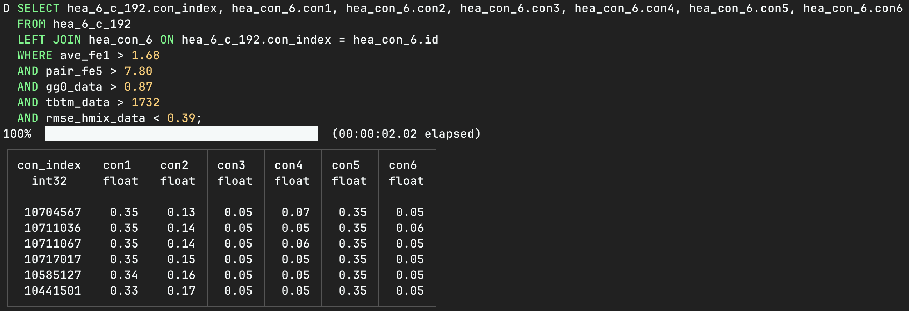
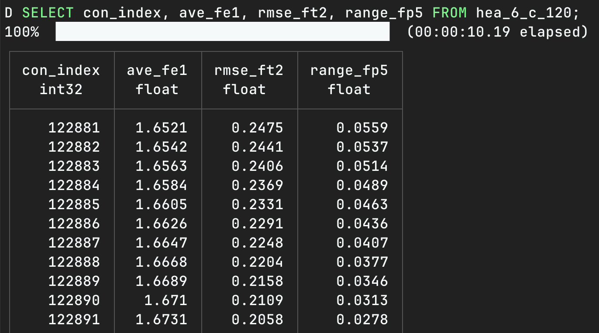
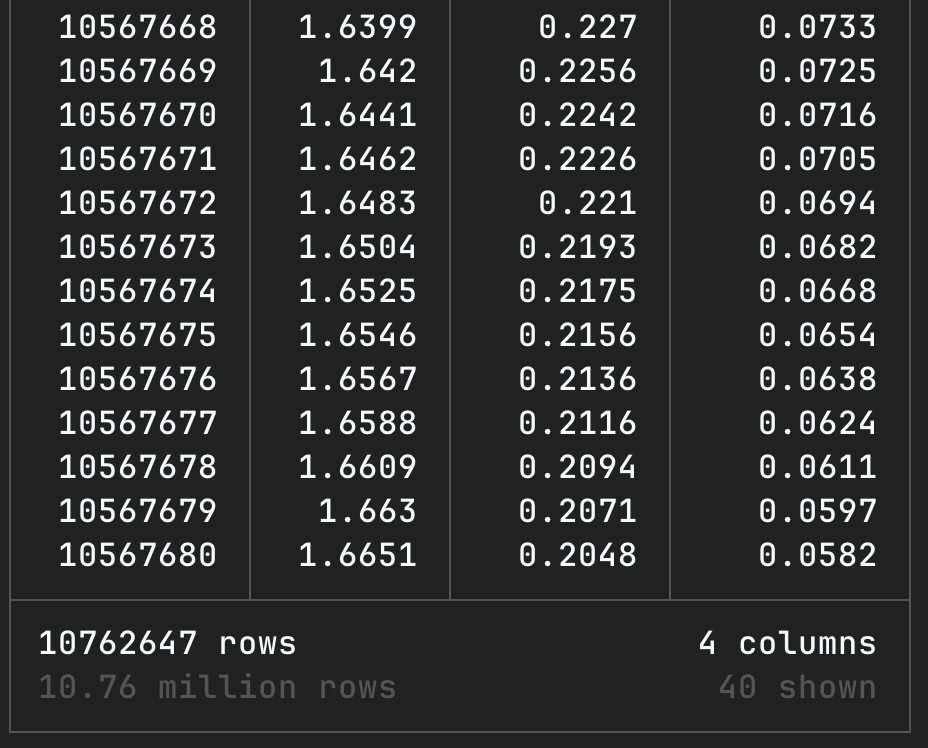

# HEA DuckLake

This project includes a foundational database for six principal elements high-entropy alloys, suitable for computations, ML training and predictions based on high-entropy alloys.

The data is distributed in the form of DuckLake's lakehouse. The project contains DuckLake's metadata files as well as an `init.sql` file for accessing the data lakehouse.

The actual total data volume of the project is nearly 20TB. Thanks to DuckLake's lakehouse technology, you only need to download tens of megabytes of metadata to remotely access the entire database.

## Usage: Taking the metadata under the descriptors path as an example

### Through DuckDB

- Install DuckDB Command Line Client: Visit the following website to install the CLI program https://duckdb.org/install/?platform=macos&environment=cli

- Install the ducklake plugin: Run `INSTALL ducklake;` in the DuckDB CLI

- Run `duckdb --init init.sql` under the descriptors path to establish connection with the lakehouse

- Use SQL to query data within the lakehouse

### Through Python

- Install the Python library duckdb: `pip install duckdb`, or use the `uv sync` command to sync dependencies. The project includes `pyproject.toml` and `uv.lock` files.

- Subsequent operation steps refer to the `use_descriptors.py` script.

## Demo

The database referenced by the `metadata.ducklake` file under the descriptors path contains a total of 5008 tables, of which 5005 are descriptors for six principal elements high-entropy alloys. Each table has 195 columns and over 10 million rows, stored in a compressed columnar format, requiring approximately more than 4GB of space. However, most queries do not require the full dataset, so query results can be returned very quickly. The following are two examples, both using SQL operations.

### Query of the  element components of six principal elements high-entropy alloys using descriptors

In a single city, queries on the public network can return results in as fast as 2 seconds. If there have been prior queries about this table, caching could make the query speed even faster. Previously, cross-city query speeds were around 4 seconds. In scenarios like cross-country or cross-continent, the speed might be a bit slower, but still fast enough.

### Query on certain columns in the data table

Thanks to column storage technology, non-full-table queries do not require transmitting all data over the network. Full table queries on the descriptor table take on the order of minutes, depending on network conditions; we have measured speeds such as 2 minutes and 7 minutes.

Queries on the con_index column and the other three descriptors are much faster, taking about 10 seconds, with most of the time spent transmitting the 10 million × 4 data back over the network.

## Additional Information

- The real data for this project is stored using OSS compatible with the S3 protocol. The metadata functions similarly to a data directory, enabling multiple users to access the data simultaneously.

- The content in `init.sql` consists of the lakehouse access information, such as `s3_endpoint='idmlakehouse.tmslab.cn';` etc. If you do not start DuckDB using `duckdb --init init.sql`, you can directly input the contents of the `init.sql` file in the DuckDB CLI or use it in Python, which will achieve the same effect.

- We have only granted read permissions to the data for general users. Please do not attempt to modify the data. It won't work.

- If you are more accustomed to using Python for data analysis rather than SQL, it is recommended to use Polars instead of Pandas. Taking the JOIN of the two tables in the above image as an example, the lazy loading feature of Polars can save more memory and offers high query efficiency. Pandas, on the other hand, requires caching the entire table in memory, and the original 4GB table consumes approximately 30GB of memory during the query process.

## License

