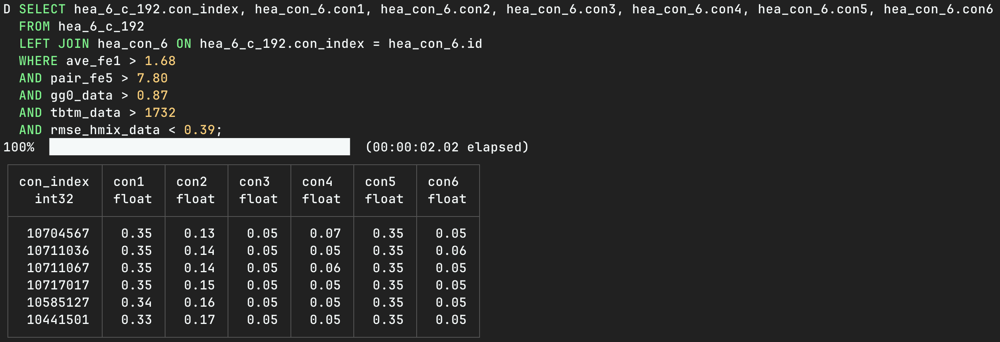
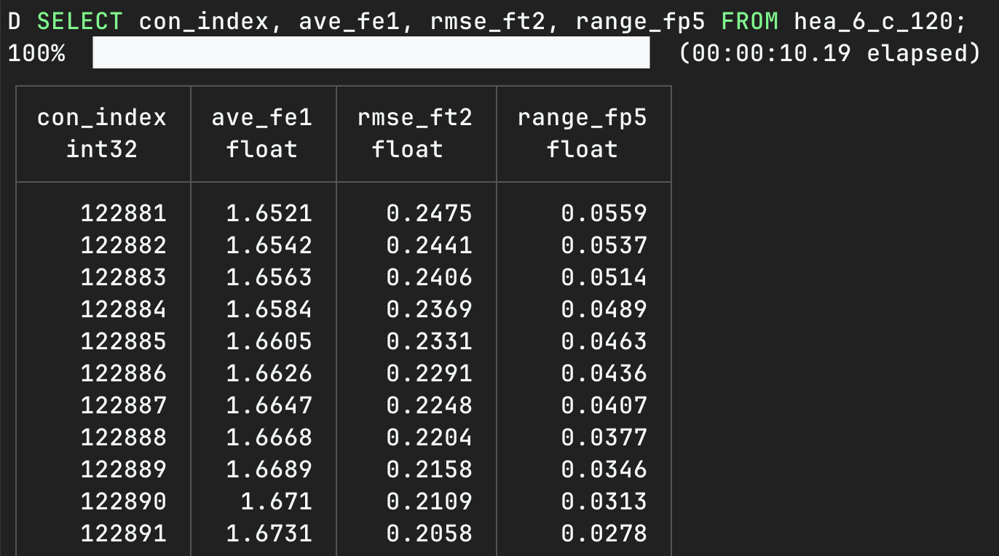
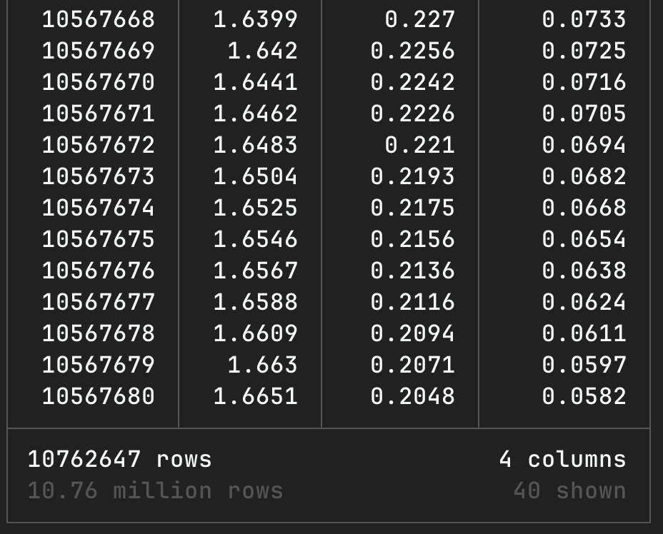
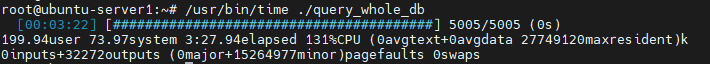
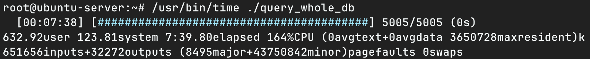
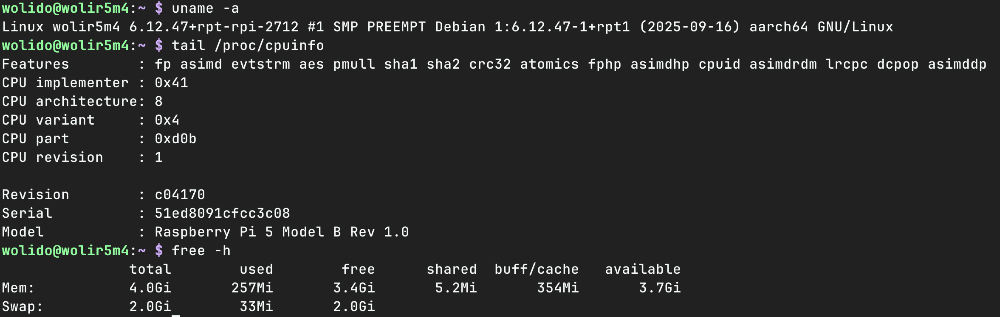
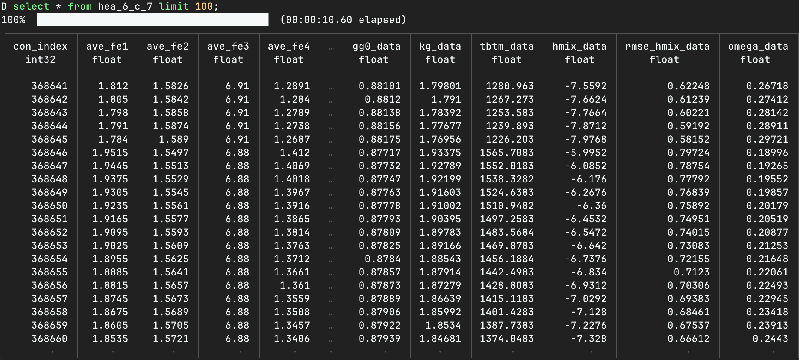
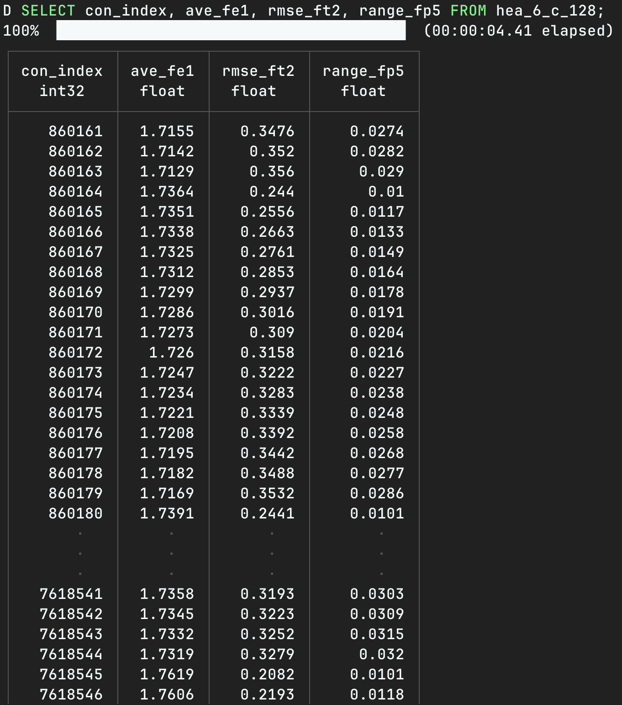
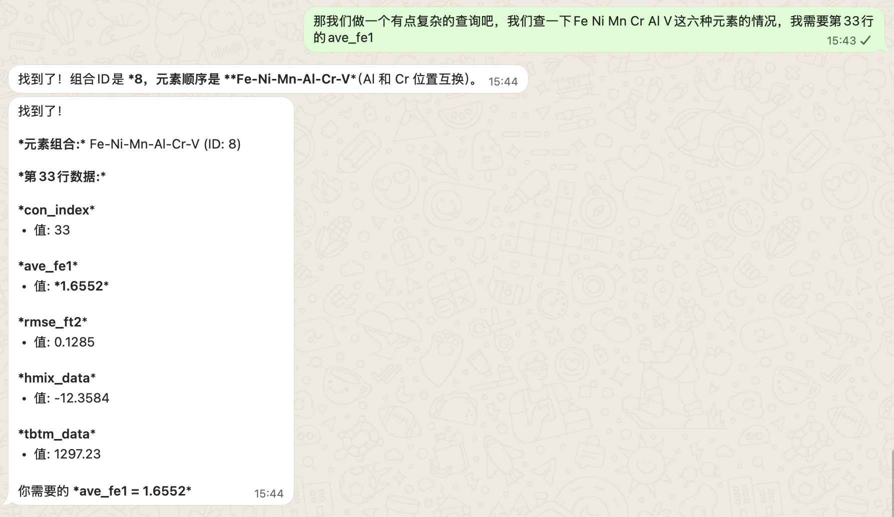

- [中文](README_zh.md)
- [English](README.md)

---

# HEA DuckLake

**A lakehouse database for six-principal-element high-entropy alloys (HEAs).**

This project provides a foundational dataset and toolchain for HEA computation, machine-learning training, and property prediction. The data is distributed as a **DuckDB/DuckLake lakehouse**: you only need to download a small metadata file (tens of MB) to query a remote dataset whose total volume is **17.5 TB**.

The repository contains:

- Lakehouse metadata files (`.ducklake`) and `init.sql` files for connecting to the data.
- The `calc_descriptors` computation pipeline used to generate the descriptors.
- A `predict_plasticity` module for ready-to-use plasticity classification.
- `examples/minimal_workflow`, a fully reproducible laptop-scale version of the whole framework.

## Table of Contents

- [Quick Start](#quick-start)
  - [Try it online with Binder](#try-it-online-with-binder)
  - [Reproduce it locally](#reproduce-it-locally)
- [What is HEA DuckLake?](#what-is-hea-ducklake)
- [Accessing the Lakehouse](#accessing-the-lakehouse)
  - [With the DuckDB CLI](#with-the-duckdb-cli)
  - [With Python](#with-python)
- [Demo & Performance](#demo--performance)
- [Data Computation Architecture](#data-computation-architecture)
- [Minimal Reproducible Workflow](#minimal-reproducible-workflow)
- [Plasticity Prediction](#plasticity-prediction)
- [Notes & Tips](#notes--tips)
- [Related Tools](#related-tools)
- [License](#license)

## Quick Start

### Try it online with Binder

Click the badge below to launch the demo notebooks directly in your browser:

[](https://mybinder.org/v2/gh/Wolido/hea_ducklake/run_demo?urlpath=%2Fdoc%2Ftree%2Frun_demo%2Fmain.ipynb)

The demo contains two notebooks:

- `main.ipynb` — basic query examples.
- `some_big_query.ipynb` — heavier queries.

> **Note:** The `.ducklake` metadata format does not support multiple concurrent connections. When running `some_big_query.ipynb`, please close `main.ipynb` first, otherwise the third cell will raise an error.

### Reproduce it locally

If you want to reproduce the integrated framework on your own machine, use `examples/minimal_workflow`. It is a laptop-scale version of the full pipeline and runs in seconds:

1. **Task generation** — HEA composition tasks are pushed to a Redis queue.
2. **Distributed computation** — Stateless Python workers compute descriptors using the same `calc_descriptors/calc_py` logic as the full pipeline.
3. **Result collection** — Descriptor rows are gathered into a CSV file.
4. **Lakehouse storage** — The CSV is converted to compressed Parquet and uploaded to a local MinIO instance (S3-compatible storage).
5. **Metadata catalog** — A small DuckDB catalog records the S3 location of the Parquet object.
6. **SQL access** — The dataset is queried through the metadata catalog without downloading the full Parquet file.

See the detailed walkthrough in [Minimal Reproducible Workflow](#minimal-reproducible-workflow) below, or jump straight to the example code:

```bash
cd examples/minimal_workflow
pip install -r requirements.txt
docker compose up -d
python generate_tasks.py
python worker.py
python collect_results.py
python convert_to_parquet.py
python upload_to_minio.py
python create_metadata.py
python query_via_metadata.py
```

## What is HEA DuckLake?

The project exposes two lakehouses:

- **`descriptor/`** — Descriptors for six-principal-element high-entropy alloys.
- **`pred_demo/`** — Machine-learning prediction results.

Files ending with `.ducklake` are metadata files. The descriptor lakehouse contains:

| Table | Purpose |
|---|---|
| `hea_elements_6` | Element combinations |
| `hea_con_6` | Element composition ratios |
| `descriptor_names` | Explanation of descriptor column names |
| `hea_6_c_x` | Descriptor data for combination index `x` in `hea_elements_6` |

The prediction lakehouse stores tables named `pred_x`, where `x` maps to the same combination index in `hea_elements_6`.

## Accessing the Lakehouse

### With the DuckDB CLI

1. Install the DuckDB CLI from [https://duckdb.org/install](https://duckdb.org/install).
2. Install the DuckLake plugin: `INSTALL ducklake;`
3. In the `descriptor/` directory run:

   ```bash
   duckdb --init init.sql
   ```

4. Query the lakehouse with SQL.

### With Python

```bash
pip install duckdb
# or use the provided pyproject.toml / uv.lock:
# uv sync
```

Then follow the steps in `use_descriptors.py`.

## Demo & Performance

The `metadata.ducklake` file under `descriptor/` references **5008 tables**, of which **5005** are six-principal-element HEA descriptor tables. Each table has **195 columns** and more than **10 million rows**, stored in compressed columnar format and requiring ~4 GB if fully materialized.

### Querying element compositions

On a public network, queries can return in as little as **2 seconds** within the same city. Cross-city queries are typically around **4 seconds**; cross-continent queries are slower but still practical.



### Querying selected columns

Columnar storage avoids full-table transfers. A projection such as `SELECT con_index, ave_fe1, rmse_ft2, range_fp5 FROM hea_6_c_128;` returns 10 million rows across four columns in about **10 seconds**.





### Full-database query

The `query_whole_db/` directory contains a Rust implementation that queries the entire database. In an internal network, a database of **50 billion combinations** was queried in **3 minutes 22 seconds** on a 4-core, 64 GB VM.



The same workload completed in **7 minutes 38 seconds** on a 4-core, 4 GB VM, resetting the DuckDB connection every 100 tables. This shows that the full database query can run comfortably on modest hardware.



### Edge-device query test

We also tested queries on a **Raspberry Pi 5 with 4 GB RAM**:



- Querying an entire single table triggers an OOM error because the compressed table already exceeds the device memory.
- `SELECT * FROM hea_6_c_xxx LIMIT 100` finishes within **10 seconds**.
- The columnar projection above (`con_index` + three descriptors) returns **10 million rows in 4 seconds**.





## Data Computation Architecture

The descriptor computation pipeline lives in `calc_descriptors/`:

- A Python orchestrator submits tasks to a Redis queue.
- Multiple stateless workers pop tasks and compute descriptors.
- Performance-critical paths are implemented in Rust and exposed to Python via PyO3 (`rs_calc_faster`).
- Each worker runs in its own Docker container and uses a single CPU core, so scaling is as simple as `docker compose --scale`.
- Workers handle `SIGINT` gracefully: they finish the current task before exiting.

Because the Redis port is exposed, workers can run anywhere — on servers, workstations, or edge devices — and can join or leave the cluster dynamically. For production-scale crowdsourced computing, see [IDM-GridCore](https://github.com/Wolido/idm-gridcore).

## Minimal Reproducible Workflow

`examples/minimal_workflow` is a self-contained, laptop-scale reproduction of the framework shown in the paper. It uses only the first 6-element family and computes a small number of compositions, so it completes in seconds.

### What it demonstrates

1. **Stateless parallel computation** — tasks are pushed to Redis and processed by identical Python workers.
2. **Descriptor computation** — each worker calls `calc_main_progress()` from `calc_descriptors/calc_py`.
3. **Result collection** — descriptor rows are written to `results.csv`.
4. **Lakehouse storage** — the CSV is converted to a compressed Parquet file and uploaded to MinIO.
5. **Metadata catalog** — a DuckDB catalog records the S3 location of the Parquet object.
6. **SQL access** — the dataset is queried through the catalog without downloading the full object.

### Prerequisites

- Python 3.10+
- Rust toolchain and `maturin`
- Docker / Docker Compose (or Homebrew MinIO as a fallback)
- Python packages listed in `examples/minimal_workflow/requirements.txt`

### Step-by-step

```bash
# 1. Compile the Rust extension
cd calc_descriptors/calc_faster_rs
maturin develop --release

# 2. Install the example dependencies
cd ../../examples/minimal_workflow
pip install -r requirements.txt

# 3. Start Redis and MinIO
docker compose up -d

# 4. Generate tasks and run a worker
python generate_tasks.py
python worker.py

# 5. Collect results and convert to Parquet
python collect_results.py
python convert_to_parquet.py

# 6. Optional: query the local Parquet directly
python query_parquet.py

# 7. Upload to MinIO and create the metadata catalog
python upload_to_minio.py
python create_metadata.py

# 8. Query through the metadata catalog
python query_via_metadata.py
```

The example supports environment variables for all endpoints, queue names, and credentials. See `examples/minimal_workflow/README.md` for the full list and troubleshooting tips (including how to run MinIO via Homebrew if Docker Hub is unreachable).

## Plasticity Prediction

The `predict_plasticity/` directory contains a ready-to-use plasticity classification module:

- `model_files/model.onnx` — trained classification model.
- `model_files/minmax_params.pkl` — Min-Max normalization parameters.
- `model_files/feature_names.json` — required descriptor columns.

The module reads descriptor parquet files (e.g. `hea_6_c_*.parquet`), applies Min-Max normalization, runs ONNX inference, and writes prediction parquet files. See `predict_plasticity/README.md` for details.

## Notes & Tips

- The real data is stored in S3-compatible object storage. The metadata acts like a data directory, allowing multiple users to access the same dataset concurrently.
- `init.sql` contains the lakehouse access configuration (e.g. `s3_endpoint='idmlakehouse.tmslab.cn';`). You can also paste its contents into the DuckDB CLI or use it from Python.
- If you store metadata in SQLite format and run `INSTALL sqlite`, multiple users can share the same metadata file.
- General users have **read-only** access. Attempts to modify the data will not succeed.
- For Python analysis we recommend **Polars** over Pandas. In the JOIN example shown above, Polars' lazy loading saves memory and is much faster. Pandas must cache the entire table in memory; a 4 GB compressed table can consume ~30 GB during the query.
- CPU core count matters. In our tests, 4–8 cores is the sweet spot; more cores cause unnecessary data partitioning and slower queries. The 3:22 full-database record was achieved on a 4-core, 64 GB VM.
- An `init-standalone.sql` is provided under `descriptor/`. It reads the metadata file directly from OSS, so no local metadata is needed. The first connection takes <10 seconds; subsequent connections are cached and as fast as local metadata. This avoids version-mismatch issues when metadata is rebuilt.
- We also tested Postgres-backed metadata. It performs well on internal networks but is very slow over the public internet, likely because Postgres data cannot be cached locally.
- When running `que_push.py` inside Docker, **do not** set `restart: always` or `restart: unless-stopped` in `docker-compose.yml`. After all tasks finish, the container will restart and begin a second round of computation. Both my colleague and I fell into this pitfall the first time 😂.
- We successfully queried the database with [OpenClaw](https://openclaw.ai) by handing the project link to the agent.

  

## Related Tools

### AI Agent Skills

- **Natural-language database queries:** [agent-hea6-ducklake](https://github.com/Wolido/agent-hea6-ducklake)
- **Distributed computing deployment:** [agent-idm-gridcore](https://github.com/Wolido/agent-idm-gridcore)

### Distributed Computing Framework

- **[IDM-GridCore](https://github.com/Wolido/idm-gridcore)** — crowdsourced parallel computing for massive-scale descriptor generation.

## License

<a rel="license" href="https://creativecommons.org/licenses/by/4.0/"></a>
