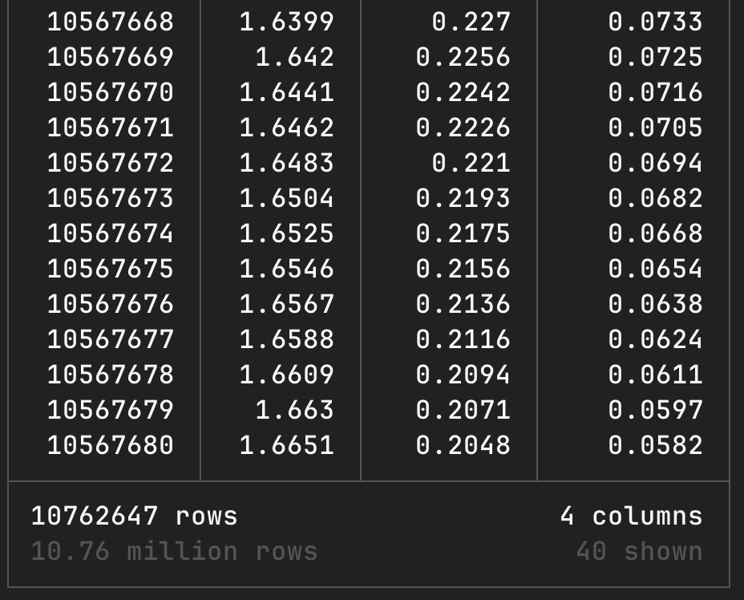

- [中文](README_zh.md)
- [English](README.md)

# HEA DuckLake

本项目包含一个六主元高熵合金的基础数据库，适用于高熵合金的计算、机器学习训练和预测流程。

数据以 DuckLake 的湖仓形式分发。该项目包含 DuckLake 的元数据文件以及用于访问数据湖仓的 `init.sql` 文件。

本项目的实际总数据量近 20TB。得益于 DuckLake 的湖仓技术，只需下载数十 MB 的元数据，即可远程访问整个数据库。

项目中有两个可访问的数据湖仓：一个是位于 `descriptor` 路径下的高熵合金描述符，另一个是位于 `pred_demo` 路径下的机器学习模型预测结果集。以 `.ducklake` 结尾的文件是湖仓的元数据文件。

描述符湖仓包含一个名为 `hea_elements_6` 的元素组合表；一个名为 `hea_con_6` 的元素组成比例表；以及一个名为 `descriptor_names` 的描述符字段名称解释表。这些表可以帮助您在查询描述符表时更好地理解和使用湖仓。描述符数据表的命名格式为 `hea_6_c_x`，其中 `x` 是 `hea_elements_6` 表中元素组合的索引。

预测数据湖仓中的表的命名格式为 `pred_x`，其中 `x` 是描述符湖仓中 `hea_elements_6` 表的元素组合索引。

## 使用方法：以 descriptors 路径下的元数据为例

### 通过 DuckDB

- 安装 DuckDB 命令行客户端：访问以下网站安装 CLI 程序 https://duckdb.org/install

- 安装 ducklake 插件：在 DuckDB CLI 中运行 `INSTALL ducklake;`

- 在 descriptors 路径下运行 `duckdb --init init.sql` 以建立与湖仓的连接

- 使用 SQL 查询湖仓中的数据

### 通过 Python

- 安装 Python 库 duckdb：`pip install duckdb`，或使用 `uv sync` 命令同步依赖。该项目包含 `pyproject.toml` 和 `uv.lock` 文件。

- 后续操作步骤请参考 `use_descriptors.py` 脚本。

## 示例演示

descriptors 路径下 `metadata.ducklake` 文件引用的数据库总共包含 5008 张表，其中 5005 张是六元高熵合金的描述符。每张表有 195 列和超过 1000 万行数据，以压缩的列存储格式存储，需要大约 4GB 以上的空间。然而，大多数查询不需要完整数据集，因此查询结果可以非常快速地返回。以下是两个示例，均使用 SQL 操作。

### 使用描述符查询六主元高熵合金的元素成分

在同一城市内，公网查询可在 2 秒内返回结果。如果之前已查询过此表，缓存机制可使查询速度更快。曾试过跨城市的查询速度约为 4 秒。在跨国或跨洲场景下，速度可能稍慢，但仍足够快了。

### 数据表中某些列的查询

得益于列存储技术，非全表查询无需传输所有数据。全表查询描述符表需要几分钟时间，具体取决于网络条件；我们测得了 2 分钟和 7 分钟的速度。

只对 con_index 列和其他三个描述符的查询要快得多，大约 10 秒，其中大部分时间消耗在了传输 1000 万 × 4 的数据。

...

### 全数据库查询

类似于之前的示例，使用描述符查询高熵合金组合，但这次查询整个数据库。此查询示例使用 Rust 编写，代码位于 `query_whole_db` 路径。

在公网环境中查询成本高且受网络速度限制，因此我们在内网环境中完成了此查询。对于总共包含 500 亿组合的数据库，全数据库查询仅用了 3 分 22 秒。

通过牺牲一些时间，全数据库查询可在 4G 内存的机器上顺利运行。我们在 4 核 4G 虚拟机上运行程序，每查询 100 个表重置一次数据库连接，最终用了 7 分 38 秒。

这样的性能确保任何 PC 都能顺利完成全数据库查询。

## 其他

- 本项目的真实数据使用与 S3 协议兼容的 OSS 存储。元数据类似于数据目录，可实现多用户同时访问数据。

- `init.sql` 中的内容是湖仓访问信息，例如 `s3_endpoint='idmlakehouse.tmslab.cn';` 等。如果不使用 `duckdb --init init.sql` 启动 DuckDB，您可以在 DuckDB CLI 中直接输入 `init.sql` 文件的内容，或在 Python 中使用，将达到相同效果。

- 将元数据保存为SQLite格式，并使用`install sqlite`安装对应插件，可让多用户使用同一元数据文件访问湖仓。

- 我们仅为普通用户授予数据的只读权限。请勿尝试修改数据。不会成功的~

- 如果您更习惯使用 Python 进行数据分析而非 SQL，建议使用 Polars 而非 Pandas。以上图片中两个表的 JOIN 为例，Polars 的惰性加载特性可以节省更多内存，并提供高效查询。Pandas 则需要将整个表缓存在内存中，原始 4GB 表在查询过程中会消耗约 30GB 内存。

- 在我们的实际测试中，过多的CPU核心并不会带来性能提升，反而造成了严重的性能下降。过多的CPU核心会造成不必要的数据分割与传输。3分22秒的这个最好的全库查询成绩，是跑在一台4核64G的虚拟机上的。也许使用单核会更快，但是我们没有做相应的测试。

## 许可协议

